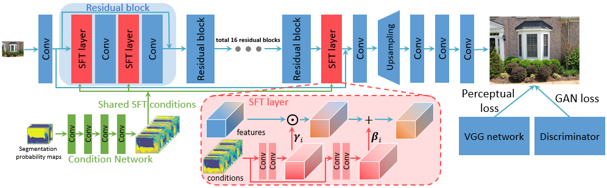

# CVPR18-SFTGAN [[project page]](http://mmlab.ie.cuhk.edu.hk/projects/SFTGAN/)   [[paper]](https://arxiv.org/abs/1804.02815)
Torch implementation (test code) for [Recovering Realistic Texture in Image Super-resolution by Deep Spatial Feature Transform](https://arxiv.org/abs/1804.02815).

---
### :stuck_out_tongue_winking_eye: [PyTorch - BasicSR](https://github.com/xinntao/BasicSR) 
The pytorch version of SFTGAN, including training and testing codes, is in [PyTorch - BasicSR](https://github.com/xinntao/BasicSR) 

[BasicSR](https://github.com/xinntao/BasicSR) contains basic codes for Super-Resolution. It has also provided basic SR models like SRResNet, SRGAN and etc.

---

### Table of Contents
1. [Introduction](#introduction)
1. [Requirements and Dependencies](#requirements-and-dependencies)
1. [Test](#test)
1. [Citation](#citation)

### Introduction
We have explored the use of semantic segmentation maps as categorical prior for SR.

A Spatial Feature Transform (SFT) layer has been proposed to efficiently incorporate the categorical conditions into a CNN network.

For more details, please check out our [project webpage](http://mmlab.ie.cuhk.edu.hk/projects/SFTGAN/) and [paper](https://arxiv.org/abs/1804.02815).

### Requirements and Dependencies
- [Torch](http://torch.ch/docs/getting-started.html)
- cuda & cudnn
- other torch dependencies, e.g. nngraph / paths / image (install them by `luarocks install xxx`)

### Test
We test our model with Titan X/XP GPU.

1. Download segmentation model (OutdoorSceneSeg_bic_iter_30000.t7) and SFT-GAN model (SFT-GAN.t7) from <a href="https://drive.google.com/drive/folders/1kFxjStgGxrKCdNzaa0Cwje5gR3OR-q1r?usp=sharing" target="_blank">google drive</a>. Put them in the `model` folder.
1. There are 2 sample images in `data/samples` folder. You can put your images inside this folder.
1. Run `th test_seg.lua`  The segmentation results are then in `data/` with `_segprob/_colorimg/_byteimg` suffix.
1. Run `th test_SFT-GAN.lua`  The results are then in `data/` with prefix `rlt_`.

### Citation
If you find the code and datasets useful in your research, please cite:

    @inproceedings{wang2018sftgan,
        author = {Xintao Wang, Ke Yu, Chao Dong and Chen Change Loy},
        title = {Recovering Realistic Texture in Image Super-resolution by Deep Spatial Feature Transform},
        booktitle = {IEEE Conference on Computer Vision and Pattern Recognition (CVPR)},
        year = {2018}

### :satisfied: Image Viewer
If you have trouble in comparing image details, may have a try for [HandyViewer](https://github.com/xinntao/HandyViewer) - an image viewer that you can switch image with a fixed zoom ratio.
