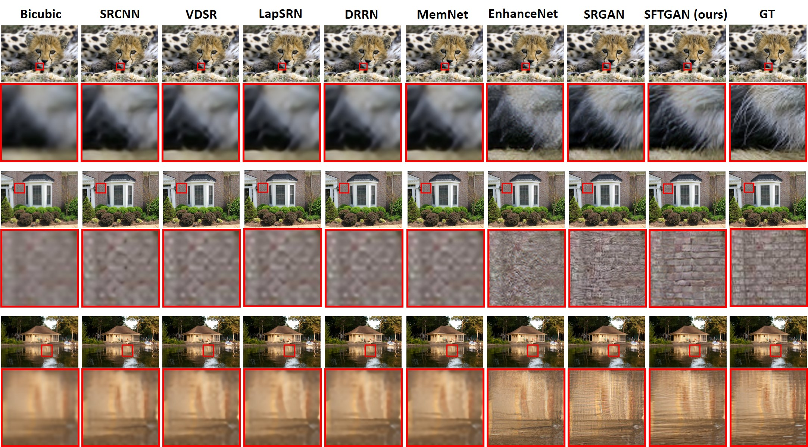
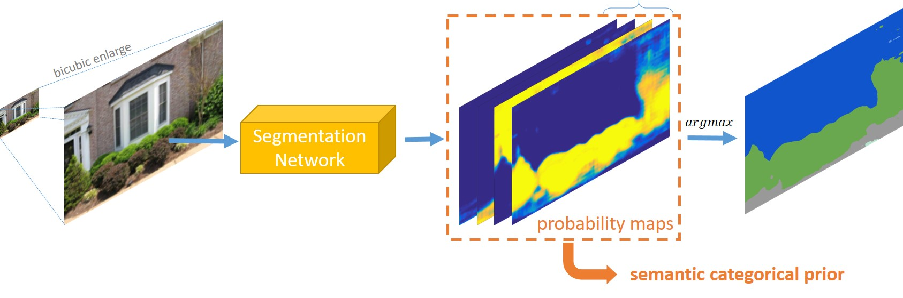
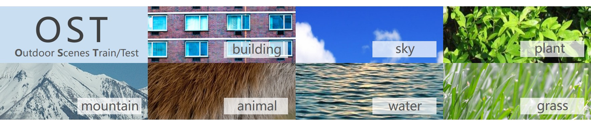

# SFTGAN [[Paper]](https://arxiv.org/abs/1804.02815) [[BasicSR]](https://github.com/xinntao/BasicSR) 
### :smiley: Training codes are in [BasicSR](https://github.com/xinntao/BasicSR) repo.

### Recovering Realistic Texture in Image Super-resolution by Deep Spatial Feature Transform
By Xintao Wang, [Ke Yu](https://yuke93.github.io/), [Chao Dong](https://scholar.google.com.hk/citations?user=OSDCB0UAAAAJ&hl=en), [Chen Change Loy](http://personal.ie.cuhk.edu.hk/~ccloy/).

This repo only provides simple testing codes - **original torch version used in the paper** and a **pytorch version**.
For full **training and testing** codes, please refer to  [BasicSR](https://github.com/xinntao/BasicSR).

#### BibTeX

    @InProceedings{wang2018sftgan,
        author = {Wang, Xintao and Yu, Ke and Dong, Chao and Loy, Chen Change},
        title = {Recovering realistic texture in image super-resolution by deep spatial feature transform},
        booktitle = {The IEEE Conference on Computer Vision and Pattern Recognition (CVPR)},
        month = {June},
        year = {2018}
    }

## Table of Contents
1. [Quick Test](#quick-test)
1. [Spatial Feature Modulation](#spatial-feature-modulation)
1. [Semantic Categorical Prior](#semantic-categorical-prior)
1. [OST dataset](#ost-dataset)

<p align="center">
  
</p>

## Quick Test
It provides Torch and PyTorch versions. Recommend the PyTorch version.
#### PyTorch Dependencies
- Python 3
- [PyTorch >= 0.4.0](https://pytorch.org/)
- Python packages:  `pip install numpy opencv-python`

#### [OR] Torch Dependencies
- [Torch](http://torch.ch/docs/getting-started.html)
- Other torch dependencies, e.g. `nngraph`, `paths`, `image` (install them by `luarocks install xxx`)

### Test models
**Note that** the SFTGAN model is limited to some outdoor scenes. It is an unsatisfying limitation that we need to relax in future.

1. Clone this github repo. 
```
git clone https://github.com/xinntao/SFTGAN
cd SFTGAN
```
2. There are two sample images in the `./data/samples` folder.
3. Download pretrained models from [Google Drive](https://drive.google.com/drive/folders/16owosaM_ADAm2FmVI9eKmuYzULVeBy7t?usp=sharing) or [Baidu Drive](https://pan.baidu.com/s/1stZurDwBouItgfrGsrMwdw). Please see [model list](https://github.com/xinntao/SFTGAN/tree/master/pretrained_models) for more details.
4. First run **segmentation** test.

[PyTorch]
```
cd pytorch_test
python test_segmentation.py
```
[Torch]
```
cd torch_test
th test_segmentation.lua
```
The segmentation results are then in `./data` with `_segprob`, `_colorimg`, `_byteimg` suffix.

5. Run **sftgan** test.

[PyTorch]
```
python test_sftgan.py.
```

[Torch]
```
th test_sftgan.lua
```

The results are in then in `./data` with `_result` suffix.


## Spatial Feature Modulation
**SFT** - **S**patial **F**eature **T**ransform (Modulation).

A Spatial Feature Transform (SFT) layer has been proposed to efficiently incorporate the categorical conditions into a CNN network.

There is a fantastic blog explaining the widely-used feature modulation operation [distill - Feature-wise transformations](https://distill.pub/2018/feature-wise-transformations/).

<p align="center">
  
</p>

<!--
Spatial feature modulation is motivated by Conditional Batch Normalization (e.g., image style transfer [[1](https://arxiv.org/abs/1610.07629), [2](https://arxiv.org/abs/1703.06868), [
3](https://arxiv.org/abs/1705.06830)] and visual reasoning [[1](https://arxiv.org/abs/1707.00683), [2](https://arxiv.org/abs/1707.03017)) ] and also feature modulation [[FiLM](https://arxiv.org/abs/1709.07871)].

(How feature modulation come?)

(Conditional Batch Normalization (image style transfer, VQA) -> FiLM)

(The connection with dynamic filter / attention models / spatial transform network)

Our SFT layer is motived by Conditional Normalization, which is used in ...

-->

## Semantic Categorical Prior

We have explored the use of semantic segmentation maps as categorical prior for SR.

<p align="center">
  
</p>

<p align="center">
  
</p>


## OST dataset
 - Outdoor Scene Train/Test
<p align="center">
  
</p>
OST (Outdoor Scenes),OST Training,7 categories images with rich textures

OST300	300 test images of outdoor scences

Download the OST dataset from [Google Drive](https://drive.google.com/drive/folders/1LIb631GU3bOyQVTeuALesD8_eoApNniB?usp=sharing) or [Baidu Drive](https://pan.baidu.com/s/1OHLfHobCcALCXut61CynXg).

### :satisfied: Image Viewer - [HandyViewer](https://github.com/xinntao/HandyViewer)
May try [HandyViewer](https://github.com/xinntao/HandyViewer) - an image viewer that you can switch image with a fixed zoom ratio, easy for comparing image details.
